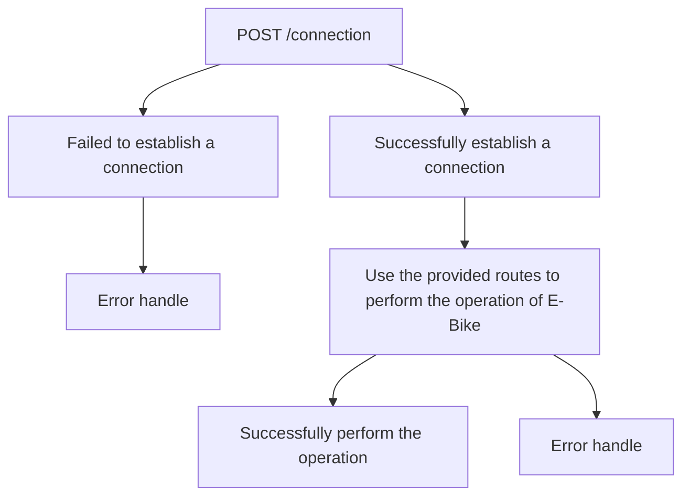

## 1. General operation flow

## 2. Connection

| Route name                   | Description                                       |
| ---------------------------- | ------------------------------------------------- |
| POST /connection             | Establish a new connection with the E-bike system |
| DELETE /connection           | Terminate the connection with the E-bike system   |
| GET /connection/state        | Get connection state observer                     |
| GET /connection/server_state | Get System Bridge server state                    |
| Get /connection/connector    | Get connector information                         |

### 2.1. POST /connection

Establish a new connection with the E-bike system.
During the connection process, System Bridge will simultaneously searches for Bluetooth devices and detects CAN-BUS communication signals.
The connection is successfully established when either method completes.
System Bridge allows only one E-bike connection at a time.
To connect to a different E-Bike system, please call `DELETE /connection` to terminate the current connection.

| Response | Description                                            |
| -------- | ------------------------------------------------------ |
| 200      | Successfully establish a connection with E-Bike system |
| 404      | There is no E-Bike system detected                     |
| 409      | Connection already exists                              |
| 500      | Connector operation error                              |

#### 2.1.1. After the connection is successfully established

##### Connection state monitor

System Bridge using connector (Dongle) to establish a connection with E-Bike system.
System Bridge will start monitor connection state after connection is successfully established, and continuously send events indicating changes in the connection state which can be observe by `GET /connection/state`

#### 2.1.2. Error definition

##### Status Code 404: There is no E-Bike system detected

System Bridge can't detect any E-Bike system due to the following possible causes:

1. CAN-BUS communication signals not detected: E-Bike System is power off or extension cable is not connect with connector.
2. Bluetooth device not detected: HMI is not double-clicked into Bluetooth pairing mode.

##### Status Code 409: Connection already exists

System Bridge already established a connection to E-Bike system.
To connect to a different E-Bike system, please call `DELETE /connection` to terminate the current connection.

##### Status Code 500: Connector operaton error

Connector operation error may occur due to the following causes:

- If using Dongle as connector:
  - Dongle is not detected by System Bridge. -> Please check Dongle is plugged in and correct driver is installed.
  - Serial port of the detectable Dongle is occupied. -> Please check serial port of Dongle is not used by other software.
  - Dongle was unplugged during connection detection.
  - Dongle has an unexpected error in sending instruction. -> If this error occurs multiple times, please contact us.

### 2.2. DELETE /connection

Terminate the connection to the E-bike system.

| Response | Description                                              |
| -------- | -------------------------------------------------------- |
| 204      | Successfully terminate the connection with E-Bike system |
| 400      | Connection does not exist                                |
| 423      | Server is busy                                           |

#### 2.2.1. Error definition

##### Status Code 400: Connection does not exist

System Bridge has not yet established a connection with E-Bike system, this operation is not available.

##### Status Code 423: Server is busy

System Bridge is busy on other operation, please call again later.

### 2.3. GET /connection/state

Initiates a Server-Sent Events (SSE) stream that allows the client to observe real-time updates on the connection state with the E-bike.
The server will continuously send events indicating changes in the connection state, such as when the connection is established, lost, or in progress.
This stream remains open, providing the latest state information as long as the client remains connected.
Alternatively, you can also use the GET method to retrieve the connection state at once.

| Response | Description                |
| -------- | -------------------------- |
| 204      | System Bridge update event |

#### 2.3.1. Connection state definition

##### bike_searching

In the process of performing `POST /connection`.

##### connected

When `POST /connection` successfully establish a connection with E-Bike system.

##### disconnected

When `POST /connection` failed to establish a connection with E-Bike system.
If `POST /connection` successfully establish a connection with E-Bike system, connection state will change to disconnected due to the following causes:

1. E-Bike system is power off.
2. E-Biks system missing the BLE connection with connector.
3. connector (Dongle) is unplugged.
4. When `DELETE /connection` successfully terminate the connection with E-Bike system.

### 2.4. GET /connection/server_state

Retrieves the current state of the connection with the E-bike.
The system bridge can only handle one command at a time.
If another request is being executed, the response will be `{"is_busy" : true}`.

| Response | Description                    |
| -------- | ------------------------------ |
| 200      | Retrieves current server state |
| 400      | Connection does not exist      |

#### 2.4.1. Error definition

##### Status Code 400: Connection does not exist

System Bridge has not yet established a connection with E-Bike system, this operation is not available.

### 2.5. GET /connection/server_state

Retrieves information about the connector.

| Response | Description                     |
| -------- | ------------------------------- |
| 200      | Retrieves connector information |
| 400      | Connection does not exist       |
| 423      | Server is busy                  |
| 500      | Connector operation error       |

#### 2.5.1. Connector information

`connector_type`: type of connector
`connector_information`: connector information

- `Dongle information`:
  - `module_id`: protocol-based serial number
  - `part_number`: part number of dongle
  - `firmware_version`: firmware version of dongle
  - `hardware_version`: hardware version of dongle

#### 2.5.2. Error definition

##### Status Code 400: Connection does not exist

System Bridge has not yet established a connection with E-Bike system, this operation is not available.

##### Status Code 423: Server is busy

System Bridge is busy on other operation, please call again later.

##### Status Code 500: Connector operaton error

Connector operation error may occur due to the following causes:

- If using Dongle as connector:
  - Dongle has an unexpected error in sending instruction. -> If this error occurs multiple times, please contact us.

## 3. Bike

| Route name            | Description                   |
| --------------------- | ----------------------------- |
| GET /bike/odometer    | Get E-Bike system odometer    |
| GET /bike/error_codes | Get E-Bike system error codes |

### 3.1. GET /bike/odometer

Retrieves the current odometer from the E-Bike system. Unit: km.

| Response | Description                                      |
| -------- | ------------------------------------------------ |
| 200      | Successfully get current E-Bike system odometer. |
| 400      | Connection does not exist                        |
| 423      | Server is busy                                   |
| 500      | Connector operation error                        |

#### 3.1.1. Error definition

##### Status Code 400: Connection does not exist

System Bridge has not yet established a connection with E-Bike system, this operation is not available.

##### Status Code 423: Server is busy

System Bridge is busy on other operation, please call again later.

##### Status Code 500: Connector operaton error

Connector operation error may occur due to the following causes:

- If using Dongle as connector:
  - Controller of this E-Bike system does not support parameter reading.
  - Read controller of this E-Bike system failed.
  - Dongle is unplugged during this operation.
  - Dongle has an unexpected error in sending instruction. -> If this error occurs multiple times, please contact us.

### 3.2. GET /bike/error_codes

Retrieves the current error code from the E-Bike system.

| Response | Description                            |
| -------- | -------------------------------------- |
| 200      | Get current E-Bike system error codes. |
| 400      | Connection does not exist              |
| 423      | Server is busy                         |
| 500      | Connector operation error              |

#### 3.2.1. Error definition

##### Status Code 400: Connection does not exist

System Bridge has not yet established a connection with E-Bike system, this operation is not available.

##### Status Code 423: Server is busy

System Bridge is busy on other operation, please call again later.

##### Status Code 500: Connector operaton error

Connector operation error may occur due to the following causes:

- If using Dongle as connector:
  - Dongle is unplugged during this operation.
  - Dongle has an unexpected error in sending instruction. -> If this error occurs multiple times, please contact us.

## 4. Component

| Route name     | Description                                                 |
| -------------- | ----------------------------------------------------------- |
| GET /component | Get detectable hyena component information of E-Bike system |

### 4.1. GET /component

Retrieves information of detectable hyena components.

| Response | Description                     |
| -------- | ------------------------------- |
| 200      | Get detectable hyena components |
| 400      | Connection does not exist       |
| 423      | Server is busy                  |
| 500      | Connector operation error       |

#### 4.1.1. Component information

##### component_type

- `hmi`
- `controller`
- `battery`
- `range_extender_battery`
- `derailleur`
- `charger`
- `motor`
- `torque_sensor`

##### Component information:

- `module_id`: protocol-based serial number
- `part_number`: part number of component
- `firmware_version`: firmware version of component
- `hardware_version`: hardware version of component
- `operation_mode`: component operation mode
  - `application_mode`
  - `bootloader_mode`

#### 4.1.2. Error definition

##### Status Code 400: Connection does not exist

System Bridge has not yet established a connection with E-Bike system, this operation is not available.

##### Status Code 423: Server is busy

System Bridge is busy on other operation, please call again later.

##### Status Code 500: Connector operaton error

Connector operation error may occur due to the following causes:

- If using Dongle as connector:
  - Dongle is unplugged during this operation.
  - Dongle has an unexpected error in sending instruction. -> If this error occurs multiple times, please contact us.

## 5. Drive Unit

| Route name                 | Description                     |
| -------------------------- | ------------------------------- |
| GET /drive_unit/ride_stats | Get ride stats of E-Bike system |

### 5.1. GET /drive_unit/ride_stats

Retrieves ride stats for E-Bike system.

| Response | Description                         |
| -------- | ----------------------------------- |
| 200      | Successfully get current ride stats |
| 400      | Connection does not exist           |
| 423      | Server is busy                      |
| 500      | Connector operation error           |

#### 5.1.1. Unit of ride stats

- `bike_speed`: Km/h
- `pedal_cadence`: RPM
- `pedal_torque`: N·m

#### 5.1.2. Error definition

##### Status Code 400: Connection does not exist

System Bridge has not yet established a connection with E-Bike system, this operation is not available.

##### Status Code 423: Server is busy

System Bridge is busy on other operation, please call again later.

##### Status Code 500: Connector operaton error

Connector operation error may occur due to the following causes:

- If using Dongle as connector:
  - Controller of this E-Bike system does not support this operation.
  - Dongle is unplugged during this operation.
  - Dongle has an unexpected error in sending instruction. -> If this error occurs multiple times, please contact us.

## 6. Power Supply

| Route name                      | Description                                  |
| ------------------------------- | -------------------------------------------- |
| GET /power_supply/battery_stats | Get power supply stats of E-Bike system      |
| POST /power_supply/sleep_mode   | Set power supply sleep mode of E-Bike system |

### 6.1. GET /power_supply/battery_stats

Retrieves current power supply stats for E-Bike system.

| Response | Description                                 |
| -------- | ------------------------------------------- |
| 200      | Successfully get current power supply stats |
| 400      | Connection does not exist                   |
| 423      | Server is busy                              |
| 500      | Connector operation error                   |

#### 6.1.1. Unit of power supply stats

- `relative_state_of_charge`: percentage
- `relative_state_of_health`: percentage
- `absolute_state_of_health`: mWh
- `charge_cycle_count`: count

#### 6.1.2. Error definition

##### Status Code 400: Connection does not exist

System Bridge has not yet established a connection with E-Bike system, this operation is not available.

##### Status Code 423: Server is busy

System Bridge is busy on other operation, please call again later.

##### Status Code 500: Connector operaton error

Connector operation error may occur due to the following causes:

- If using Dongle as connector:
  - Read battery stats of this E-Bike system failed.
  - Dongle is unplugged during this operation.
  - Dongle has an unexpected error in sending instruction. -> If this error occurs multiple times, please contact us.

### 6.2. POST /power_supply/sleep_mode

Sends a command to set the E-Bike system into sleep mode.

| Response | Description                                    |
| -------- | ---------------------------------------------- |
| 204      | Successfully set E-Bike system into sleep mode |
| 400      | Connection does not exist                      |
| 423      | Server is busy                                 |
| 500      | Connector operation error                      |

#### 6.1.2. Error definition

##### Status Code 400: Connection does not exist

System Bridge has not yet established a connection with E-Bike system, this operation is not available.

##### Status Code 423: Server is busy

System Bridge is busy on other operation, please call again later.

##### Status Code 500: Connector operaton error

Connector operation error may occur due to the following causes:

- If using Dongle as connector:
  - Read battery stats of this E-Bike system failed.
  - Dongle is unplugged during this operation.
  - Dongle has an unexpected error in sending instruction. -> If this error occurs multiple times, please contact us.

## 7. System Bridge

| Route name                      | Description                       |
| ------------------------------- | --------------------------------- |
| GET /system_bridge/version      | Get current System Bridge version |
| GET /system_bridge/update_check | System Bridge update check        |
| POST /system_bridge/update      | Update System Bridge              |

### 7.1. GET /system_bridge/version

Retrieves the current System Bridge version.

| Response | Description                       |
| -------- | --------------------------------- |
| 200      | Get current System Bridge version |

### 7.2. GET /system_bridge/update_check

Checks if a new System Bridge version is available.

| Response | Description                                               |
| -------- | --------------------------------------------------------- |
| 200      | Successfully get latest System Bridge version             |
| 500      | Unexpected error while check latest System Bridge version |

### 7.3. POST /system_bridge/update

Updates System Bridge to the latest version.

| Response | Description                                               |
| -------- | --------------------------------------------------------- |
| 204      | Successfully update System Bridge                         |
| 400      | System Bridge is now up-to-date                           |
| 500      | Unexpected error while check latest System Bridge version |
